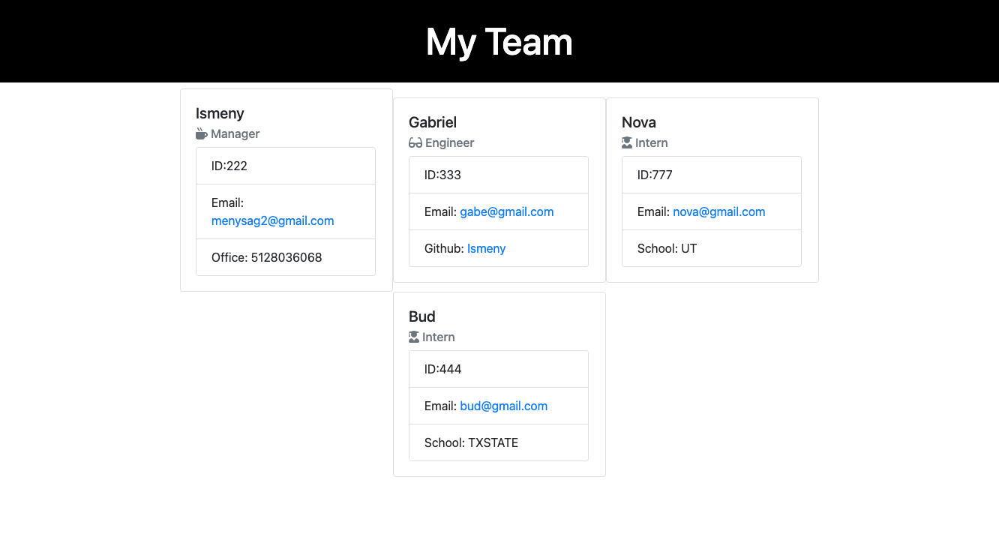

# Team-Profile-Generator

## Description
This application accepts user input and then generates and HTML file that displays a formatted team roster based on the user input. 

## Table of contents
  - [Installation](#installation)
  - [Usage](#usage)
  - [Credits](#credits)
  - [License](#license)
  - [Test](#test)
  - [Questions](#questions)
  

## Installation
Video link  : ***https://watch.screencastify.com/v/SNrWmMURwBFaj8HG01gh***

## Usage
When you run command "node index.js" the user will be prompted for team information. There are several questions that must be answered and will only be captured if they are in the correct format due to the validation on the input. After you answer all questions for your team you will select the "Finish team" option which will then generate the HTML file you can open in your browser. You will be presented with a card for each team member you entered information for. 

## Credits
Uses the Inquierer Package  
Uses Jest  
Received help from: 
* Jayla De'nae - peer
* Damien Luzzo - peer 
* Bradley O'Dell - peer

## License
MIT Licensce

## Contributions
n/a
## Test
n/a
## Questions
Github: Ismeny Saguilan - https://github.com/Ismeny  
Email: menysag2@gmail.com